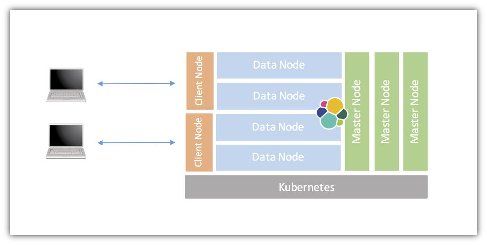

# Elasticsearch StatefulSet Data Pod Openshift
This directory contains Openshift configurations which run elasticsearch data pods as a [`StatefulSet`](https://kubernetes.io/docs/concepts/abstractions/controllers/statefulsets/), using storage provisioned using a [`StorageClass`](http://blog.kubernetes.io/2016/10/dynamic-provisioning-and-storage-in-kubernetes.html). Be sure to read and understand the documentation in the root directory, which deploys the data pods as a `Deployment` using an `emptyDir` for storage.



## Storage
The [`aws-storage-class.yaml`](aws-storage-class.yaml) file creates a `StorageClass` which allocates persistent disks in an Amazon Web Services environment. It should be relatively simple to modify this file to suit your needs for a different environment.

The [`es-data-stateful.yaml`](es-data-stateful.yaml) file contains a `volumeClaimTemplates` section which references the `StorageClass` defined in [`aws-storage-class.yaml`](aws-storage-class.yaml), and requests a 1 GB disk. This is plenty of space for a demonstration cluster, but will fill up quickly under moderate to heavy load. Consider modifying the disk size to your needs.


## Edit Openshift Security Context

oc patch scc/privileged -p '{"allowedCapabilities": ["IPC_LOCK", "SYS_RESOURCE"]}'

## Add your current project and serviceaccount to scc/privileged

oc edit scc privileged

## Deploy
The root directory contains instructions for deploying elasticsearch using a `Deployment` with transient storage for data pods. These brief instructions show a deployment using the `StatefulSet` and `StorageClass`.

```
oc create -f es-discovery-svc.yaml
oc create -f es-svc.yaml
oc create -f es-master.yaml
```

Wait until `es-master` deployment is provisioned, and

```
oc create -f es-client.yaml
oc create -f aws-storage-class.yaml
oc create -f es-data-svc.yaml
oc create -f es-data-stateful.yaml
```

Openshift creates the pods for a `StatefulSet` one at a time, waiting for each to come up before starting the next, so it may take a few minutes for all pods to be provisioned.

## References

* [kubernetes-elasticsearch-cluster](https://github.com/pires/kubernetes-elasticsearch-cluster)
